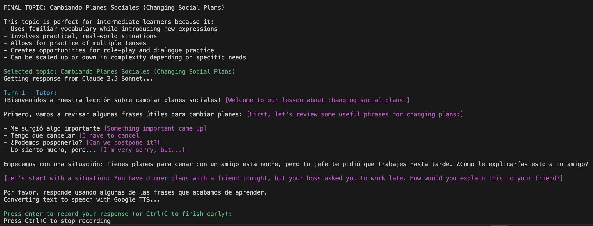

# Talko

Talko is an AI-powered language learning assistant that provides interactive, spoken conversations for language practice. It creates personalized lessons, tracks your progress, and adapts to your proficiency level. 

I created Talko as a personal tool in March 2023, with some updates since then to include newer models. It's not as polished as I'd like, but others asked me to share so here it is :)

## Features


- **Interactive Speech Practice**: Have natural conversations with an AI tutor that listens and responds
- **Multi-Language Support**: Practice in Spanish, French, German, Italian, Portuguese, Russian, Chinese, Korean, Hindi, and more
- **Progress Tracking**: Get detailed feedback on your learning journey and personalized recommendations
- **Dynamic Lessons**: Enjoy unique, level-appropriate topics generated for each session
- **Scaffolded Learning**: Pronunciation and translation hints for easier levels
- **Intelligent Feedback**: Receive gentle corrections and natural phrasing suggestions
- **Customizable Experience**: Adjust speech rate and choose from multiple voices per language

## Usage

Start a diagnostic session in Spanish:
```bash
python talko.py --lang es --level diagnostic --user yourname
```

Continue practicing French at level 5:
```bash
python talko.py --lang fr --level 5 --user yourname
```

During a session:
- Press `<enter>` to start recording your response
- Press `<Ctrl+C>` to stop recording
- Your speech will be transcribed and shown in the terminal
- The AI tutor will respond both in text and speech
- Press `<Ctrl+C>` twice to end the session early

## Setup

1. Install requirements:
   ```bash
   pip install -r requirements.txt
   ```

2. Set up your API keys:
   ```bash
   # Add to your ~/.bash_profile or equivalent
   export ANTHROPIC_API_KEY='your-anthropic-key'
   export DEEPGRAM_API_KEY='your-deepgram-key'
   ```

   (Deepgram gives you $200 in [free credits](https://deepgram.com/pricing))

3. Ensure you have Python 3.11+ installed

## How it Works

Talko combines several technologies to create a smooth learning experience:

1. **Speech Recording**: Uses SoundDevice to capture your voice input
2. **Speech-to-Text**: Converts your speech to text using Deepgram Nova 2
3. **Conversation**: Generates responses using Claude 3.5 Sonnet
4. **Text-to-Speech**: Converts responses to speech using gTTS or native macOS voices
5. **Progress Tracking**: Maintains detailed learning records with personalized feedback

## Progress Tracking

Talko maintains a record of your learning journey:
- Overall progress assessment
- Language-specific goals
- Zone of proximal development recommendations
- Lesson summaries
- Proficiency level tracking

Progress files are stored in your user folder and updated after each session. (The prompts here were written by Claude and could be improved.)

## Supported Languages

| Language Code | Language   
| ------------- | ---------- 
| es            | Spanish    
| en            | English    
| fr            | French     
| zh-CN         | Chinese    
| de            | German     
| it            | Italian    
| pt            | Portuguese 
| ru            | Russian    
| ko            | Korean     
| hi            | Hindi      

## Note

Talko is intended for casual language practice. While it provides helpful feedback and corrections, always verify important phrases or grammar points with authoritative sources (dictionaries, textbooks, or native speakers).


## License
MIT

## Additional acknowledgments
README written with Claude :)